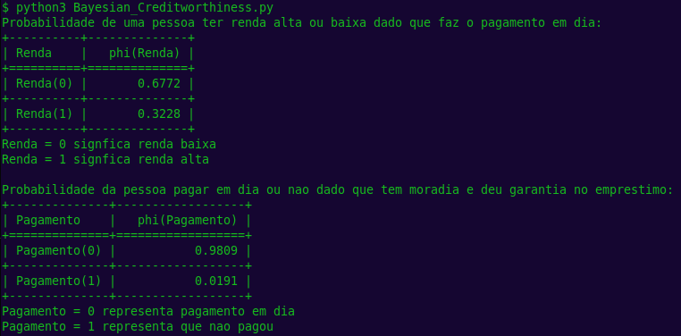

# Documentação sobre o algoritmo da rede Bayesiana

## Objetivo
Implementar uma rede Bayesiana para modelar incertezas em um conjunto de variáveis e realizar inferências probabilísticas com base em evidências observadas.

## Descrição do problema
O cenário abaixo é uma rede Bayesiana que descreve as relações de dependência entre os principais fatores considerados no processo de análise de crédito de um cliente. Nessa rede, variáveis como renda, depósitos realizados, pontualidade nos pagamentos, posse de imóvel próprio e garantia oferecida no empréstimo são modeladas de forma probabilística. Logo, é possível calcular a probabilidade de certos comportamentos financeiros ocorrerem a partir de evidências observadas, como por exemplo, a chance de um cliente não efetuar o pagamento em dia dado que possui renda baixa e não forneceu garantia no empréstimo, contribuindo assim para uma análise de risco mais informada na concessão de crédito.

<center>


A rede pode ser encontrada no arquivo `IA_e_incertezas/assets/Bayesian_Creditworthiness_image.jpg`.

</center>

Explicação das variáveis envolvidas:

### Income (Renda)

Refere-se ao nível de renda do solicitante de crédito
-  Renda = 0 representa renda baixa
-  Renda = 1 representa renda alta

### Deposit (Depósito) 

Indica o histórico ou o tamanho médio dos depósitos realizados pelo cliente
- Deposito = 0 representa deposito pequeno
- Deposito = 1 representa deposito grande

### Payment (Pagamento)

Representa o comportamento do cliente em relação ao cumprimento de suas obrigações financeiras
- Pagamento = 0 representa pagamento em dia
- Pagamento = 1 representa que não pagou

### Housing (Moradia)

Informa se o cliente possui imóvel próprio, o que pode indicar estabilidade financeira e menor risco para a instituição
- Moradia = 0 representa que não possui imovel
- Moradia = 1 representa que possui imovel

### Security (Garantia)

Corresponde à oferta de uma garantia (como um bem ou fiador) ao solicitar o empréstimo
- Garantia = 0 representa que não deu garantia no emprestimo
- Garantia = 1 representa deu garantia no emprestimo

## Como rodar o código
1. Certifique-se de ter o Python instalado em sua máquina juntamente com a biblioteca `pgmpy`.
2. Navegue até o diretório `IA_e_incertezas` onde o arquivo `Bayesian_Creditworthiness.py` está localizado.
3. Execute o script com o comando:
    ```bash
    python3 Bayesian_Creditworthiness.py
    ```
## Exemplo de uso

<center>



</center>