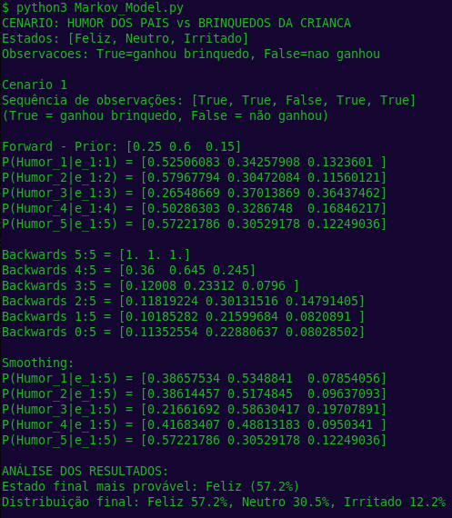
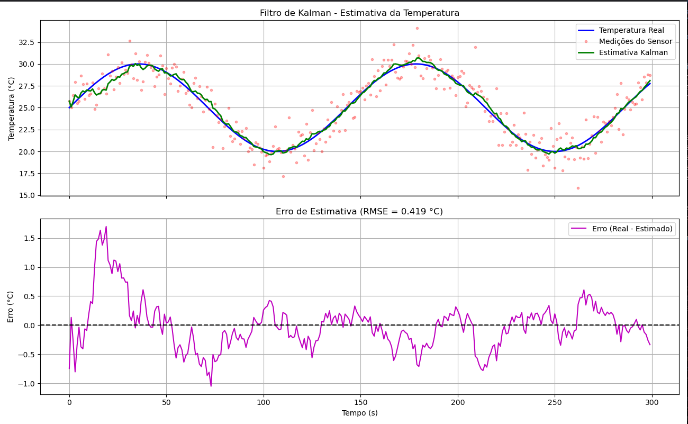

# Documentação sobre o algoritmo da rede Bayesiana

## Objetivo
Implementar uma rede Bayesiana para modelar incertezas em um conjunto de variáveis e realizar inferências probabilísticas com base em evidências observadas.

## Descrição do problema
O cenário abaixo é uma rede Bayesiana que descreve as relações de dependência entre os principais fatores considerados no processo de análise de crédito de um cliente. Nessa rede, variáveis como renda, depósitos realizados, pontualidade nos pagamentos, posse de imóvel próprio e garantia oferecida no empréstimo são modeladas de forma probabilística. Logo, é possível calcular a probabilidade de certos comportamentos financeiros ocorrerem a partir de evidências observadas, como por exemplo, a chance de um cliente não efetuar o pagamento em dia dado que possui renda baixa e não forneceu garantia no empréstimo, contribuindo assim para uma análise de risco mais informada na concessão de crédito.

<center>


A rede pode ser encontrada no arquivo `IA_e_incertezas/assets/Bayesian_Creditworthiness_image.jpg`.

</center>

Explicação das variáveis envolvidas:

### Income (Renda)

Refere-se ao nível de renda do solicitante de crédito
-  Renda = 0 representa renda baixa
-  Renda = 1 representa renda alta

### Deposit (Depósito) 

Indica o histórico ou o tamanho médio dos depósitos realizados pelo cliente
- Deposito = 0 representa deposito pequeno
- Deposito = 1 representa deposito grande

### Payment (Pagamento)

Representa o comportamento do cliente em relação ao cumprimento de suas obrigações financeiras
- Pagamento = 0 representa pagamento em dia
- Pagamento = 1 representa que não pagou

### Housing (Moradia)

Informa se o cliente possui imóvel próprio, o que pode indicar estabilidade financeira e menor risco para a instituição
- Moradia = 0 representa que não possui imovel
- Moradia = 1 representa que possui imovel

### Security (Garantia)

Corresponde à oferta de uma garantia (como um bem ou fiador) ao solicitar o empréstimo
- Garantia = 0 representa que não deu garantia no emprestimo
- Garantia = 1 representa deu garantia no emprestimo

## Como rodar o código
1. Certifique-se de ter o Python instalado em sua máquina juntamente com a biblioteca `pgmpy`.
2. Navegue até o diretório `IA_e_incertezas` onde o arquivo `Bayesian_Creditworthiness.py` está localizado.
3. Execute o arquivo com o comando:
    ```bash
    python3 Bayesian_Creditworthiness.py
    ```
## Exemplo de uso

<center>


</center>

# Documentação sobre o algoritmo de modelos Markovianos ocultos(Forward-Backwar: Suavização)

## Objetivo

Implementar um modelo Makoviano Oculto através dos algoritmos de Forward, Backward e Smoothing (Forward-Backward) para realizar inferência probabilística em modelos dinâmicos ocultos, estimando a evolução do estado interno de um sistema ao longo do tempo com base em observações parciais e incertas

## Descrição do problema

O cenário modela o humor dos pais que pode ser Feliz, Neutro ou Irritado ao longo de vários dias em função de observações externas — se a criança ganhou ou não um brinquedo em determinado dia. O humor dos pais é uma variável oculta (não observada diretamente), enquanto o evento da criança receber ou não um brinquedo é a evidência observável

Logo abaixo temos a matriz de transição de estados que define as probabilidades de mudança de humor dos pais de um dia para o outro:

| De \ Para | Feliz | Neutro |Irritado|
|-----------|-------|--------|--------|
| Feliz     | 0.4   |   0.5  | 0.1    |
| Neutro    | 0.2   |   0.6  | 0.2    |
| Irritado  | 0.1   |   0.4  | 0.5    |

Logo abaixo temos a matriz de observação que define as probabilidades de observar se a criança ganhou ou não um brinquedo, dado o humor dos pais:

| Humor dos Pais | P(Ganhou Brinquedo) | P(Não Ganhou Brinquedo) |
|----------------|---------------------|-------------------------|
| Feliz          | 0.65                | 0.35                    |
| Neutro         | 0.4                 | 0.6                     |
| Irritado       | 0.2                 | 0.8                     |

Essa modelagem permite compreender como os estados emocionais dos pais evoluem diante de diferentes padrões de comportamento da criança, simulando um modelo de crença temporal em que o humor é influenciado tanto pelo estado anterior quanto pelas observações recebidas

## Como rodar o código
1. Certifique-se de ter o Python instalado em sua máquina juntamente com a biblioteca `numpy`.
2. Navegue até o diretório `IA_e_incertezas` onde o arquivo `Markov_Model.py` está localizado.
3. Execute o arquivo com o comando:
    ```bash
    python3 Markov_Model.py
    ```

## Exemplo de uso

<center>



</center>

# Documentação sobre o algoritmo de Filtro de Kalman

## Objetivo
Implementar o filtro de Kalman para estimar de forma recursiva e ótima o estado de um sistema dinâmico sujeito a ruído gaussiano, combinando previsões baseadas em um modelo de transição de estados com atualizações provenientes de medições ruidosas. O objetivo é fornecer uma estimativa contínua e refinada do estado real do sistema ao longo do tempo.

## Descrição do problema

O cenário modelado simula a estimativa de temperatura ao longo do tempo usando o filtro de Kalman. A temperatura real segue um padrão periódico composto por um deslocamento constante (temperatura média de 25°C) somado a uma componente senoidal de amplitude 5°C e período de aproximadamente 100 segundos. Este sinal representa, por exemplo, variações térmicas naturais em um ambiente controlado ou flutuações de temperatura em um processo industrial.

As medições são obtidas através de um sensor que adiciona ruído gaussiano com desvio padrão de 1.5°C às leituras reais, simulando imperfeições típicas de sensores físicos. O desafio consiste em recuperar a temperatura verdadeira a partir dessas medições ruidosas.

O filtro de Kalman é implementado com um modelo de estado tridimensional:
- **Estado 1**: Deslocamento (temperatura média)
- **Estado 2**: Componente senoidal (s)
- **Estado 3**: Componente cossenoidal (c)

Essa representação lineariza a evolução temporal da componente harmônica através de uma matriz de transição rotacional baseada em cos(ωΔt) e sin(ωΔt), permitindo que o filtro acompanhe tanto a tendência constante quanto a oscilação periódica.

A matriz de observação H = [1.0, 1.0, 0.0] mapeia o estado estimado para a medição, somando o deslocamento com a componente senoidal. O filtro alterna entre duas etapas a cada passo temporal:
1. **Predição**: Projeta o estado atual para o próximo instante usando a matriz de transição A e atualiza a covariância do erro com a matriz de ruído de processo Q.
2. **Atualização**: Calcula o ganho de Kalman K e corrige a predição com base na diferença entre a medição real e a predição, levando em conta o ruído de observação R.

O resultado é uma estimativa suavizada da temperatura que filtra o ruído do sensor enquanto acompanha fielmente a dinâmica real do sistema, conforme evidenciado pelo baixo erro quadrático médio (RMSE) entre a temperatura real e a estimada.

## Como rodar o código
1. Certifique-se de ter o Python instalado em sua máquina juntamente com a biblioteca `numpy` e `matplotlib`.
2. Navegue até o diretório `IA_e_incertezas` onde o arquivo `Kalman_Filter.py` está localizado.
3. Execute o arquivo com o comando:
    ```bash
    python3 Kalman_Filter.py
    ``` 

## Exemplo de uso
<center>



</center>

