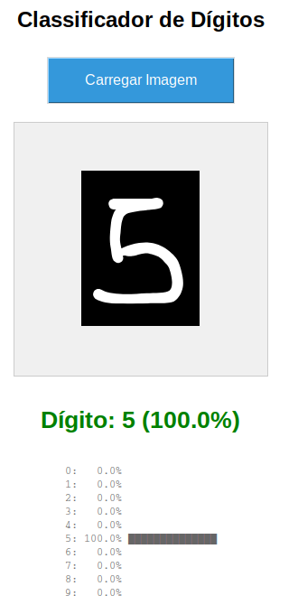

# Documentação do CNN para Reconhecimento de Dígitos (MNIST)

## Introdução

O reconhecimento de dígitos manuscritos é um dos problemas clássicos em visão computacional e aprendizado de máquina. Segundo LeCun et al. (1998), as Redes Neurais Convolucionais (CNNs) revolucionaram este campo ao aprenderem hierarquias de características diretamente dos pixels das imagens, eliminando a necessidade de engenharia manual de features.

As CNNs são especialmente eficazes em tarefas de visão computacional porque exploram a estrutura espacial das imagens através de operações de convolução, que preservam a relação entre pixels vizinhos. Esta arquitetura, inspirada no córtex visual de mamíferos, tornou-se o padrão para classificação de imagens.

Este documento apresenta uma implementação completa de CNN para reconhecimento de dígitos manuscritos usando o dataset MNIST, incluindo uma interface gráfica (GUI) para facilitar a utilização do modelo treinado. O objetivo é demonstrar desde o treinamento até a aplicação prática do modelo.

## Objetivo

O objetivo deste projeto é desenvolver e documentar um sistema completo de reconhecimento de dígitos manuscritos que consiste em:

1. **Treinamento de uma CNN** otimizada para classificar dígitos (0-9) do dataset MNIST
2. **Interface Gráfica (GUI)** intuitiva para carregar e classificar imagens de dígitos
3. **Avaliação detalhada** do desempenho do modelo com métricas e visualizações

## Descrição do Problema

### Dataset: MNIST

O **MNIST (Modified National Institute of Standards and Technology)** é um dos datasets mais famosos em aprendizado de máquina, contendo dígitos manuscritos coletados e normalizados.

**Características do Dataset:**
- **Tamanho**: 70.000 imagens (60.000 treino + 10.000 teste)
- **Dimensões**: 28×28 pixels
- **Formato**: Grayscale (escala de cinza, 0-255)
- **Classes**: 10 dígitos (0, 1, 2, 3, 4, 5, 6, 7, 8, 9)
- **Distribuição**: Aproximadamente balanceado (~7.000 exemplos por dígito no treino)

## Arquitetura da CNN

### Estrutura Geral

A CNN implementada segue uma arquitetura moderna com BatchNormalization e Dropout para melhor generalização:

```
Input (28×28×1)
    ↓
[Bloco Convolucional 1] - 32 filtros
    ↓
[Bloco Convolucional 2] - 64 filtros
    ↓
[Camadas Densas] - 256 neurônios
    ↓
Output (10 classes)
```

### Bloco Convolucional 1

**Componentes:**
- `Conv2D(32, 3×3, ReLU)`: Detecta 32 features básicas (bordas, curvas)
- `BatchNormalization()`: Normaliza ativações para estabilizar treino
- `Conv2D(32, 3×3, ReLU)`: Segunda camada convolucional (aprofunda features)
- `MaxPooling2D(2×2)`: Reduz dimensionalidade (downsampling)
- `Dropout(0.25)`: Desativa 25% dos neurônios para evitar overfitting

**Dimensões:**
```
28×28×1 → 26×26×32 → 26×26×32 → 24×24×32 → 12×12×32
```

### Bloco Convolucional 2

**Componentes:**
- `Conv2D(64, 3×3, ReLU)`: Detecta 64 features complexas
- `BatchNormalization()`: Normalização
- `Conv2D(64, 3×3, ReLU)`: Aprofunda representações
- `MaxPooling2D(2×2)`: Redução espacial
- `Dropout(0.25)`: Regularização

**Dimensões:**
```
12×12×32 → 10×10×64 → 10×10×64 → 8×8×64 → 4×4×64
```

### Camadas Densas

**Componentes:**
- `Flatten()`: Transforma matriz 4×4×64 em vetor de 1024 elementos
- `Dense(256, ReLU)`: Camada totalmente conectada (aprendizado de padrões complexos)
- `BatchNormalization()`: Normalização
- `Dropout(0.5)`: Regularização forte (50%)
- `Dense(10, Softmax)`: Camada de saída (10 probabilidades somando 1.0)

**Justificativa da Arquitetura:**
- **Múltiplas Conv2D**: Extração hierárquica de features (simples → complexas)
- **BatchNormalization**: Acelera convergência e estabiliza treino
- **MaxPooling**: Reduz parâmetros e torna modelo invariante a pequenas translações
- **Dropout**: Previne overfitting forçando o modelo a aprender features robustas

## Interface Gráfica (GUI)

A GUI foi desenvolvida em **Tkinter** (biblioteca padrão do Python) para fornecer uma interface simples e intuitiva para testar o modelo treinado.

**Funcionalidades:**
- Carregamento de imagens (PNG, JPG, JPEG, BMP)
- Pré-processamento automático das imagens
- Predição em tempo real
- Visualização de probabilidades para todas as classes
- Design responsivo e amigável

## Como Rodar o Código

### Pré-requisitos

Certifique-se de ter as seguintes bibliotecas instaladas:

```bash
pip install tensorflow numpy matplotlib scikit-learn seaborn pillow
```

**Versões recomendadas:**
- TensorFlow: ≥ 2.10.0
- NumPy: ≥ 1.23.0
- Matplotlib: ≥ 3.5.0
- Pillow: ≥ 9.0.0


### Execução

**Passo 1: Treinar o Modelo**

```bash
python cnn_digitos.py
```

**Saída esperada:**
```
Epoch 1/20
422/422 [==============================] - 45s 105ms/step - loss: 0.2134 - accuracy: 0.9345 - val_loss: 0.0654 - val_accuracy: 0.9802
Epoch 2/20
422/422 [==============================] - 43s 102ms/step - loss: 0.0723 - accuracy: 0.9781 - val_loss: 0.0478 - val_accuracy: 0.9852
...
Epoch 00015: early stopping
Restoring model weights from the end of the best epoch: 10

Total de testes: 10000
Acertos: 9912 (99.12%)
Erros: 88 (0.88%)

Acurácia por dígito:
  Dígito 0: 0.9969 (99.69%)
  Dígito 1: 0.9965 (99.65%)
  Dígito 2: 0.9913 (99.13%)
  ...
```

**Passo 2: Executar a GUI**

```bash
python gui_cnn_digitos.py
```

**Ações na GUI:**
1. Clique em "Carregar Imagem"
2. Selecione uma imagem de dígito
3. Visualize a predição e probabilidades


## Exemplos de Uso

<center>



</center>

## Conclusão

### Desempenho Alcançado

O modelo CNN desenvolvido alcançou **acurácia de ~99.2%** no dataset MNIST, demonstrando excelente capacidade de generalização para reconhecimento de dígitos manuscritos. A arquitetura com BatchNormalization e Dropout foi fundamental para:

1. **Prevenir overfitting**: Gap treino-validação < 1%
2. **Acelerar convergência**: 10-15 épocas suficientes
3. **Estabilizar treinamento**: Learning curves suaves

**Limitações:**
- Funciona apenas com dígitos (0-9), não letras
- Melhor performance com dígitos centralizados
- Requer pré-processamento para imagens não-padrão
- Modelo relativamente grande (~6 MB) para aplicações embarcadas

## Referências

- LeCun, Y., Bottou, L., Bengio, Y., & Haffner, P. (1998). *Gradient-based learning applied to document recognition*. Proceedings of the IEEE, 86(11), 2278-2324.
- Goodfellow, I., Bengio, Y., & Courville, A. (2016). *Deep Learning*. MIT Press.
- TensorFlow Documentation: https://www.tensorflow.org/
- Keras Documentation: https://keras.io/
- MNIST Database: http://yann.lecun.com/exdb/mnist/
