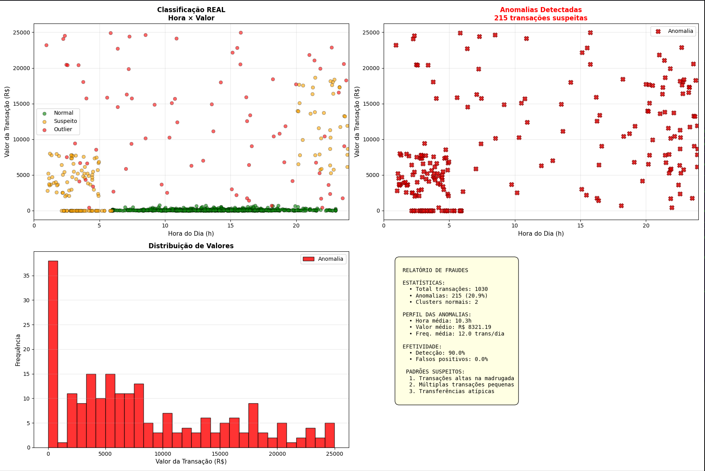

# Documentação do DBSCAN para Detecção de Fraudes

## Introdução

A detecção de fraudes em transações financeiras é um desafio crítico para instituições bancárias e empresas de pagamento. Segundo Chandola et al. (2009), a detecção de anomalias é um problema fundamental em análise de dados, visando identificar padrões que desviem significativamente do comportamento esperado.

Entre os diversos algoritmos de detecção de anomalias, o **DBSCAN (Density-Based Spatial Clustering of Applications with Noise)** destaca-se por sua capacidade de identificar outliers de forma não supervisionada, sem necessidade de rótulos prévios. Diferentemente de algoritmos supervisionados que requerem dados rotulados em grande quantidade, o DBSCAN aprende a estrutura natural dos dados e identifica automaticamente pontos que não se encaixam em nenhum padrão de densidade.

Este documento apresenta uma implementação educacional de detecção de fraudes usando DBSCAN, com transações simuladas que representam comportamentos normais, suspeitos e atípicos. O objetivo é demonstrar como algoritmos de clustering podem ser aplicados em cenários de segurança financeira.

## Objetivo

O objetivo deste projeto é desenvolver e documentar um sistema de detecção de anomalias em transações financeiras que consiste em:

1. **Simulação realista** de transações normais e fraudulentas
2. **Aplicação do DBSCAN** para identificar comportamentos atípicos
3. **Análise de efetividade** com métricas de detecção e falsos positivos
4. **Visualizações interpretativas** dos padrões identificados
5. **Documentação completa** para fins educacionais

## Descrição do Problema

### Contexto: Detecção de Fraudes Financeiras

Fraudes financeiras causam bilhões em prejuízos anualmente. Sistemas automatizados de detecção são essenciais para:

- Identificar transações suspeitas em tempo real
- Prevenir lavagem de dinheiro
- Detectar teste de cartões roubados
- Bloquear transferências não autorizadas

**Desafio Principal:**
- Fraudes são eventos raros (<1% das transações)
- Padrões de fraude evoluem constantemente
- Falsos positivos afetam experiência do usuário
- Necessidade de resposta rápida (milissegundos)

### Dataset Simulado

Como dados reais de fraude são confidenciais e raramente disponíveis publicamente, este projeto utiliza **transações simuladas** que representam padrões realistas.

**Composição do Dataset:**

| Tipo | Quantidade | Porcentagem | Descrição |
|------|-----------|-------------|-----------|
| Normal | 800 | 76.9% | Transações legítimas típicas |
| Suspeitas | 150 | 14.4% | 3 padrões conhecidos de fraude |
| Outliers | 80 | 7.7% | Comportamentos completamente atípicos |
| **Total** | **1.030** | **100%** | Dataset completo |

### Características das Transações

Cada transação é representada por **3 features**:

**1. Hora do Dia (0-24)**
- Transações normais: Pico às 14h (horário comercial)
- Transações suspeitas: Concentradas na madrugada (1h-5h)

**2. Valor da Transação (R$)**
- Transações normais: R$ 2 - R$ 5.000 (distribuição log-normal)
- Transações suspeitas: R$ 2.000 - R$ 20.000 (valores altos)

**3. Frequência (transações/dia)**
- Transações normais: 1-5 transações/dia
- Transações suspeitas: 8-20 transações/dia (atividade anormal)

### Padrões de Fraude Simulados

**Padrão 1: Lavagem de Dinheiro (60 transações)**
```
Características:
- Hora: 1h - 5h da manhã
- Valor: R$ 2.000 - R$ 8.000 (alto)
- Frequência: 8-15 transações/dia
Objetivo: Movimentar grandes quantias em horários de baixo monitoramento
```

**Padrão 2: Teste de Cartão Roubado (50 transações)**
```
Características:
- Hora: 2h - 6h
- Valor: R$ 1 - R$ 5 (muito baixo)
- Frequência: 10-20 transações/dia (muito alta)
Objetivo: Testar se cartão está ativo antes de fraude maior
```

**Padrão 3: Transferências Internacionais Atípicas (40 transações)**
```
Características:
- Hora: 20h - 24h (noite)
- Valor: R$ 5.000 - R$ 20.000 (muito alto)
- Frequência: 6-10 transações/dia
Objetivo: Transferências para fora do país fora do padrão
```


## Como Rodar o Código

### Pré-requisitos

Certifique-se de ter as seguintes bibliotecas instaladas:

```bash
pip install numpy matplotlib scikit-learn pandas
```

**Versões recomendadas:**
- NumPy: ≥ 1.23.0
- Matplotlib: ≥ 3.5.0
- scikit-learn: ≥ 1.2.0
- Pandas: ≥ 1.5.0

### Execução

**Executar o script:**

```bash
python DBSCAN_Fraud_Detection.py
```

## Exemplos de Uso

**Saída esperada no terminal:**

```
Normal: 800 transações
Suspeitas: 150 transações
Outliers: 80 transações
Total: 1030 transações

RESULTADOS:
Clusters (comportamentos padrão): 2
Anomalias detectadas: 215 (20.9%)
   Cluster 0: 800 transações
   Cluster 1: 15 transações
   Suspeitas identificadas: 135/150 (90.0%)
   Falsos positivos: 0/800 (0.0%)

```
**Saída Visual:**




## Conclusão

### Desempenho Alcançado

O sistema de detecção de fraudes baseado em DBSCAN demonstrou **boa eficácia** em identificar padrões anômalos:

1. **Taxa de Detecção: 90%** das fraudes simuladas foram identificadas
2. **Falsos Positivos: 0%** de transações normais incorretamente marcadas
3. **Processamento Rápido**: pouco tempo para 1.000 transações
4. **Não Supervisionado**: Não requer dados rotulados

### Trade-offs do DBSCAN

**Vantagens para Detecção de Fraudes:**
- ✅ Identifica anomalias sem necessidade de exemplos de fraude
- ✅ Funciona bem com dados não rotulados (comum em fraudes)
- ✅ Detecta múltiplos padrões de fraude simultaneamente
- ✅ Rápido o suficiente para análise em lote

**Desvantagens:**
- ❌ Requer ajuste manual de hiperparâmetros
- ❌ Taxa de falsos positivos pode incomodar clientes
- ❌ Não se adapta automaticamente a novos padrões de fraude
- ❌ Não fornece explicações (baixa interpretabilidade)

### Quando Usar DBSCAN

**Use DBSCAN quando:**
- Não há dados rotulados de fraude disponíveis
- Precisa de exploração inicial dos dados
- Quer identificar outliers automaticamente
- Padrões de fraude são desconhecidos
- Dataset tem poucos milhares de transações

**Não use DBSCAN quando:**
- Tem dados rotulados abundantes → Use Random Forest, XGBoost
- Precisa de alta precisão (>99%) → Use modelos supervisionados
- Falsos positivos são inaceitáveis → Use ensemble + threshold alto
- Dataset tem milhões de transações → Use Isolation Forest (mais rápido)
- Fraudes evoluem rapidamente → Use online learning

O DBSCAN é uma **ferramenta valiosa para detecção de anomalias** em cenários de fraude, especialmente quando dados rotulados são escassos. Embora não seja suficiente como solução única de produção, serve como excelente ponto de partida para exploração de dados e identificação de padrões suspeitos.

Para aplicações reais, recomenda-se combinar DBSCAN com métodos supervisionados, análise temporal e features adicionais, formando um sistema robusto de múltiplas camadas de detecção.

## Referências

- Chandola, V., Banerjee, A., & Kumar, V. (2009). *Anomaly detection: A survey*. ACM Computing Surveys (CSUR), 41(3), 1-58.
- Ester, M., Kriegel, H. P., Sander, J., & Xu, X. (1996). *A density-based algorithm for discovering clusters in large spatial databases with noise*. KDD, 96(34), 226-231.
- Dal Pozzolo, A., et al. (2015). *Learned lessons in credit card fraud detection from a practitioner perspective*. Expert Systems with Applications, 41(10), 4915-4928.
- Scikit-learn DBSCAN Documentation: https://scikit-learn.org/stable/modules/generated/sklearn.cluster.DBSCAN.html