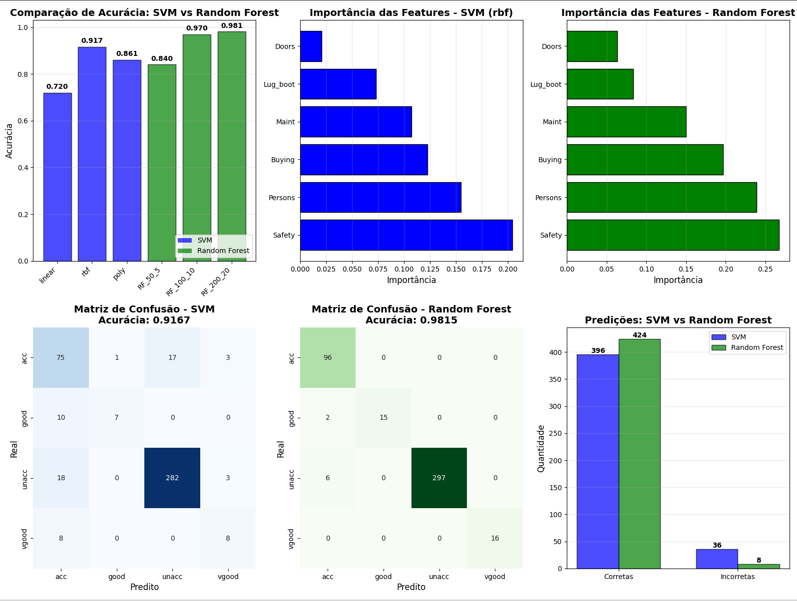

# Documentação do arquivo SVM_VS_Random Forest

## Introdução

O aprendizado de máquina tem se consolidado como uma das áreas centrais da inteligência artificial, possibilitando que sistemas computacionais identifiquem padrões e extraiam conhecimento a partir de dados, sem a necessidade de instruções explícitas para cada tarefa. Segundo Bishop (2006), o aprendizado de máquina envolve um conjunto de métodos que permitem aos modelos generalizar a partir de exemplos, tornando-se capazes de realizar previsões ou classificações de forma autônoma.

Dentro desse cenário, a seleção adequada do algoritmo desempenha um papel decisivo para o êxito de qualquer projeto de aprendizado de máquina, influenciando diretamente o desempenho, a capacidade de generalização e a eficiência do modelo resultante.

Entre os diversos métodos disponíveis, Support Vector Machines (SVM) e Random Forest destacam-se por sua robustez, eficiência e ampla aplicação em diferentes domínios, que vão desde classificação de imagens até análise de dados estruturados. A seguir, apresenta-se uma análise comparativa entre esses dois algoritmos, considerando suas principais características, vantagens e comportamento em um conjunto de dados específico.

## Objetivo
O objetivo deste arquivo é comparar o desempenho de dois algoritmos de aprendizado de máquina: Support Vector Machine (SVM) e Random Forest, utilizando um conjunto de dados específico. A comparação será feita com base em métricas de avaliação como acurácia, precisão, recall e F1-score.

## Descrição do problema

### Dataset: Car Evaluation Database

O conjunto de dados utilizado neste estudo é o **Car Evaluation Database**, que contém 1.728 instâncias de avaliação de carros baseadas em seis atributos categóricos:

**Atributos (Features):**
- `buying`: Preço de compra (vhigh, high, med, low)
- `maint`: Custo de manutenção (vhigh, high, med, low)
- `doors`: Número de portas (2, 3, 4, 5more)
- `persons`: Capacidade de pessoas (2, 4, more)
- `lug_boot`: Tamanho do porta-malas (small, med, big)
- `safety`: Segurança estimada (low, med, high)

**Variável Alvo (Target):**
- `car`: Avaliação do carro (unacc, acc, good, vgood)

### Problema de Classificação

O desafio consiste em **classificar a aceitabilidade de um carro** (unacc, acc, good, vgood) com base nas suas características. Trata-se de um problema de classificação multiclasse com dados categóricos, onde:

- **unacc** (unacceptable): Carro inaceitável
- **acc** (acceptable): Carro aceitável
- **good**: Carro bom
- **vgood** (very good): Carro muito bom

### Pré-processamento

Dado que tanto SVM quanto Random Forest trabalham com valores numéricos, todos os atributos categóricos são convertidos para representações numéricas usando **LabelEncoder** do scikit-learn. Essa técnica atribui um número inteiro único para cada categoria.

### Divisão dos Dados

Os dados são divididos em conjuntos de treino e teste com as seguintes características:
- **75%** para treinamento
- **25%** para teste
- Estratificação aplicada para manter a proporção das classes

## Algoritmos Comparados

### 1. Support Vector Machine (SVM)

O SVM é um algoritmo de aprendizado supervisionado que busca encontrar um hiperplano ótimo que maximize a margem entre diferentes classes. Neste estudo, três kernels são testados:

- **Linear**: Adequado para dados linearmente separáveis
- **RBF (Radial Basis Function)**: Kernel gaussiano, eficaz para relações não-lineares
- **Polynomial**: Permite modelar relações polinomiais de grau 3

**Vantagens:**
- Eficaz em espaços de alta dimensionalidade
- Robusto contra overfitting (especialmente em dimensões altas)
- Versátil através do uso de diferentes kernels

**Desvantagens:**
- Tempo de treinamento elevado para grandes datasets
- Sensível à escolha do kernel e hiperparâmetros
- Não fornece importância de features nativamente

### 2. Random Forest

Random Forest é um método de ensemble que constrói múltiplas árvores de decisão durante o treinamento e produz a classe que é o modo das classes (classificação) das árvores individuais.

**Configurações testadas:**
- RF_50_5: 50 árvores, profundidade máxima 5
- RF_100_10: 100 árvores, profundidade máxima 10
- RF_200_20: 200 árvores, profundidade máxima 20

**Vantagens:**
- Menos propenso a overfitting que árvores individuais
- Fornece importância de features nativamente
- Robusto a outliers e ruídos
- Não requer normalização dos dados

**Desvantagens:**
- Pode ser lento na predição com muitas árvores
- Menos interpretável que uma árvore de decisão simples
- Tende a ser enviesado para features com mais categorias

## Como rodar o código

### Pré-requisitos

Certifique-se de ter as seguintes bibliotecas instaladas:

```bash
pip install numpy pandas matplotlib scikit-learn seaborn
```


### Execução

1. **Execute o script:**
   ```bash
   python SVM_VS_Random_Forest.py
   ```

3. **Saída esperada:**
   - Resultados de treino para cada configuração de SVM (linear, rbf, poly)
   - Resultados de treino para cada configuração de Random Forest
   - Melhor modelo de cada algoritmo
   - Matrizes de confusão
   - Relatórios de classificação detalhados
   - 6 gráficos comparativos


## Exemplos de uso

Terminal:
```python
# O código automaticamente treina todos os modelos
# e exibe as acurácias no terminal:

# Saída esperada:
"""
Treinamento do SVM:

Treinando SVM com kernel linear...
  Acurácia: 0.7199 (71.99%)

Treinando SVM com kernel rbf...
  Acurácia: 0.9167 (91.67%)

Treinando SVM com kernel poly...
  Acurácia: 0.8611 (86.11%)

Melhor modelo: rbf (Acurácia: 0.9167)

----------------------------------------------------------------------
Treinamento do Random Forest

Treinando Random Forest (n_estimators=50, max_depth=5)...
  Acurácia: 0.8403 (84.03%)

Treinando Random Forest (n_estimators=100, max_depth=10)...
  Acurácia: 0.9699 (96.99%)

Treinando Random Forest (n_estimators=200, max_depth=20)...
  Acurácia: 0.9815 (98.15%)

Melhor Random Forest: RF_200_20 (Acurácia: 0.9815)

----------------------------------------------------------------------
Comparacoes

Matriz de Confusão do SVM:
[[ 75   1  17   3]
 [ 10   7   0   0]
 [ 18   0 282   3]
 [  8   0   0   8]]

Matriz de Confusão do SVM:
[[ 96   0   0   0]
 [  2  15   0   0]
 [  6   0 297   0]
 [  0   0   0  16]]

Relatório de Classificação do SVM:
              precision    recall  f1-score   support

         acc       0.80      0.83      0.82        96
        good       1.00      0.29      0.45        17
       unacc       0.95      0.98      0.97       303
       vgood       1.00      0.81      0.90        16

    accuracy                           0.92       432
   macro avg       0.94      0.73      0.78       432
weighted avg       0.92      0.92      0.91       432


Relatório de Classificação do Random Forest:
              precision    recall  f1-score   support

         acc       0.92      1.00      0.96        96
        good       1.00      0.88      0.94        17
       unacc       1.00      0.98      0.99       303
       vgood       1.00      1.00      1.00        16

    accuracy                           0.98       432
   macro avg       0.98      0.97      0.97       432
weighted avg       0.98      0.98      0.98       432

"""
```
Detalhes visuais:

### Conclusão do experimento

**Insights Principais:**
- Safety e Persons são as features mais importantes para ambos os algoritmos
- A classe 'good' apresenta menor representação no dataset, causando dificuldade na classificação
- Random Forest demonstrou melhor equilíbrio entre precisão e recall em todas as classes

Nesse contexto, o **Random Forest (200 árvores, profundidade 20)** demonstrou superioridade clara em termos de acurácia (98.15%), equilíbrio entre métricas e capacidade de lidar com todas as classes de forma eficaz. No entanto, o SVM com kernel RBF também apresentou desempenho satisfatório (91.67%), sendo uma alternativa viável quando há restrições de recursos computacionais ou quando se busca um modelo mais compacto.

A escolha entre os algoritmos deve considerar não apenas a acurácia, mas também requisitos específicos do projeto, como interpretabilidade, tempo de treinamento/predição e recursos disponíveis.

**Use SVM quando:**
- Dataset é pequeno a médio (<10.000 instâncias)
- Alta dimensionalidade com poucas amostras
- Fronteira de decisão é complexa e não-linear (usar kernel RBF)
- Precisão máxima é crítica e tempo de treinamento não é problema
- Necessita de garantias teóricas sobre margem de separação

**Use Random Forest quando:**
- Precisa de importância de features interpretável
- Dataset contém outliers ou ruído significativo
- Velocidade de treinamento é crucial
- Dataset é grande (>10.000 instâncias)
- Busca por equilíbrio entre precisão e recall
- Dados têm relações complexas e hierárquicas


## Referências

- Bishop, C. M. (2006). *Pattern Recognition and Machine Learning*. Springer.
- Mitchell, T. M. (1997). *Machine Learning*. McGraw-Hill.
- Scikit-learn Documentation: https://scikit-learn.org/
- Car Evaluation Database: UCI Machine Learning Repository
