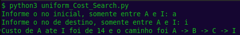
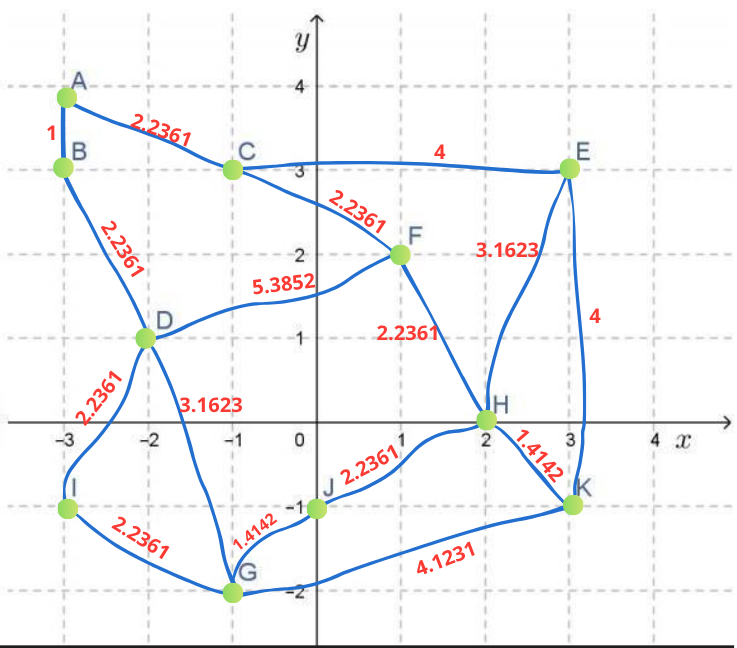
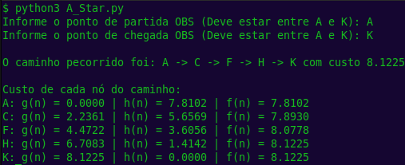
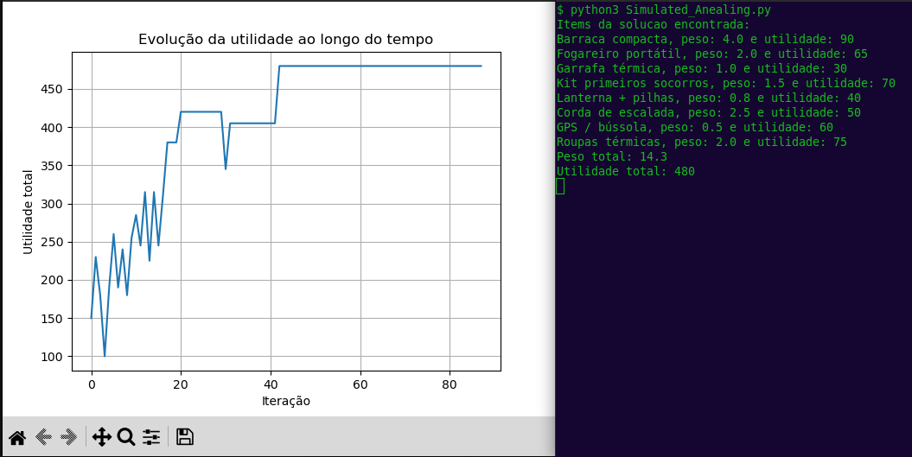
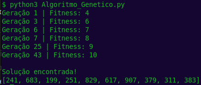
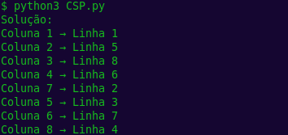

# Documentação sobre o algoritmo de busca não informada - UCS (Uniform Cost Search)

## Objetivo
Resolver o problema de menor custo em um grafo ponderado (encontrar caminho de custo mínimo entre um nó inicial e os demais). A implementação usa uma heap mínima indexada para manter a frontier (open set) e permitir atualizações de prioridade em O(log n) com acesso direto ao elemento em O(1).

## Descrição do problema
Dado um grafo G = (V, E) com arestas ponderadas não‑negativas, e um nó inicial s ∈ V, o algoritmo encontra o menor custo (g(n)) do nó s até todos os nós alcançáveis, incluve o nó de objetivo.

<center>


O grafo pode ser visualmente encontrado no arquivo `metodos_classicos/assets/grafo_Uniform_Cost_Search.png`.

</center>

## Como rodar o código

1. Certifique-se de ter Python instalado em sua máquina juntamente com a biblioteca numPy.
2. Navegue até o diretório `metodos_classicos` onde o arquivo `Uniform_Cost_Search.py` está localizado.
3. Execute o script com o comando:

    ```bash
    python3 uniform_Cost_Search.py
    ```
4. Siga as instruções na tela para fornecer o nó inicial e o nó de destino

## Exemplo de uso

<center>



</center>

# Documentação sobre o algoritmo de busca informada - A* (A‑Star)

## Objetivo
Encontrar o caminho de menor custo entre um nó inicial e um nó objetivo num grafo ponderado usando heurística admissível (g(n) + h(n)) para guiar a busca e acelerar a expansão.

## Descrição do problema
Dado um grafo G = (V, E) com arestas ponderadas não‑negativas, A* mantém custos g(n) (custo desde a origem) e uma heurística h(n) (estimativa do custo até o objetivo). O nó expandido é o que minimiza f(n) = g(n) + h(n). h(n) é a distância euclidiana entre o nó atual e o objetivo.

<center>



</center>

## Como usar
1. Certifique-se de ter Python instalado em sua máquina juntamente com a biblioteca numPy.
1. Abra `metodos_classicos`.
1. Rode:

   ```bash
   python3 A_Star.py
   ```
1. Defina os nós e as arestas (ou use o exemplo presente).
1. Informe ponto de partida e chegada quando solicitado.


## Exemplo de uso
<center>



</center>

# Documentação sobre o algoritmo de busca complexa - Simulated Annealing

## Objetivo
Encontrar soluções aproximadas para problemas de otimização (ex.: mochila, percurso) usando uma busca estocástica que aceita soluções piores com probabilidade decrescente para escapar de mínimos locais.

## Descrição do problema

Dado um conjunto de itens e uma função objetivo (utilidade) sujeita a uma restrição (capacidade), o algoritmo tenta maximizar a utilidade total encontrando uma solução binária (incluir/excluir) através de perturbações sucessivas e resfriamento da "temperatura".

## Como rodar
1. Certifique-se de ter Python instalado em sua máquina juntamente com a biblioteca matplotlib
1. Abra `metodos_classicos`.
1. Rode:

   ```bash
   python3 Simulated_Anealing.py
   ```

## Exemplo de uso
<center>



</center>

# Documentação sobre o Algoritmo Genético (Algoritmo_Genetico.py)

## Objetivo
Encontrar soluções aproximadas para problemas de otimização (como o problema dos números primos, mochila ou rota) por meio da evolução de uma população de candidatos, usando operadores inspirados na biologia: seleção, cruzamento e mutação.

## Descrição do problema
Dado um conjunto de indivíduos representados por vetores de inteiros, o algoritmo aplica seleção baseada em aptidão (fitness), cruzamento entre pares de indivíduos selecionados e mutação aleatória para gerar novas gerações. O objetivo é evoluir a população ao longo de várias iterações, melhorando progressivamente a aptidão média dos indivíduos.

Neste exemplo específico, busca-se gerar um vetor de números em que todos os elementos sejam primos, fazendo com que, ao longo das gerações, a população evolua até conter apenas indivíduos compostos exclusivamente por números primos.

## Como rodar
1. Certifique-se de ter Python instalado em sua máquina.
2. Abra `metodos_classicos`.
3. Rode:
    ```bash
    python3 Algoritmo_Genetico.py
    ```
## Exemplo de uso
<center>



</center>

# Documentação sobre o alggoritmo CPS (Constraint Satisfaction Problem)

## Objetivo
Resolver problemas de satisfação de restrições (CSP) onde o objetivo é atribuir valores a um conjunto de variáveis, respeitando um conjunto de restrições. Dado um conjunto de variáveis, cada uma com um domínio de valores possíveis, e um conjunto de restrições que especificam quais combinações de valores são permitidas, o algoritmo busca uma atribuição de valores que satisfaça todas as restrições. O algoritmo utiliza técnicas como backtracking, forward checking e heurísticas de escolha de variáveis para explorar eficientemente o espaço de busca. 

## Descrição do problema
Resolver o problema das 8 damas atribuindo valores (linhas) a variáveis (colunas), respeitando as restrições do problema.
A solução final deve garantir que todas as damas possam coexistir no tabuleiro sem conflitos.

## Como rodar
1. Certifique-se de ter Python instalado em sua máquina.
2. Abra `metodos_classicos`.
3. Rode:
    ```bash
    python3 CPS.py
    ```

## Exemplo de uso

<center>



</center>